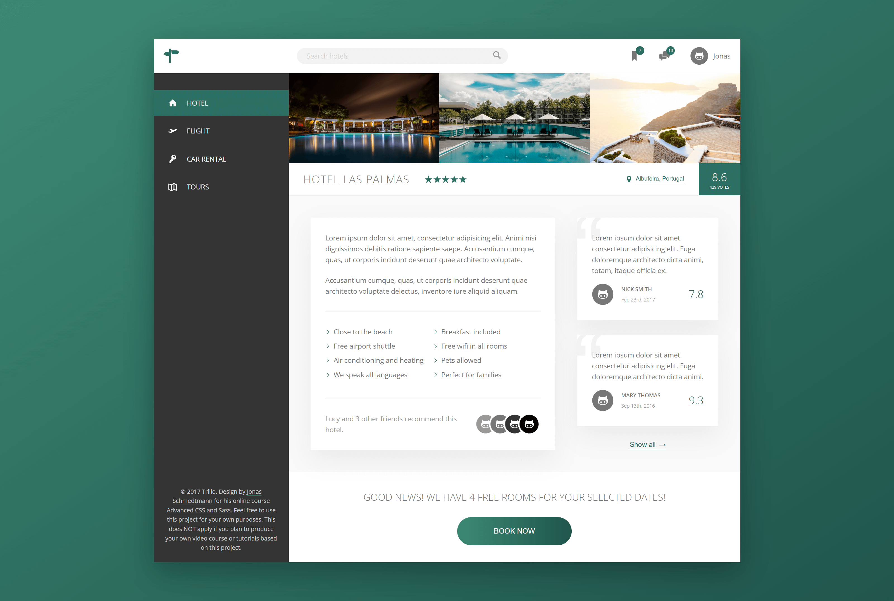

# 🏨 Trillo

A responsive hotel booking dashboard-style UI. Designed to practice layout techniques, component structure, and modern CSS capabilities — all built using semantic HTML and SCSS.

**🔗 Live Demo**: [Trillo](https://dobbyssockk.github.io/trillo/)

---

## 🧭 Project Overview

Trillo is a conceptual front-end project styled to look like a hotel search and booking platform. It includes a top navigation bar, user interactions, and flexible sidebar layout — all crafted using modern CSS architecture and SCSS modules.

---

## 🚀 Features

- Responsive layout
- Flexbox-based layout with custom sidebar
- Booking summary section with call-to-action
- Search bar with icon interaction
- Hotel preview cards with ratings and user avatars

---

## 🛠️ Technologies Used

- **HTML5** – semantic and accessible markup
- **CSS3** – animations, flexbox layout, transitions
- **SCSS** – modular structure with variables, mixins, and partials
- **BEM methodology** – consistent class naming and reusable components
- **SVG sprite system** – for icons and interaction symbols
- **Google Fonts** – Open Sans for clean, professional typography

---

## 💡 Key Concepts

- **Modular SCSS architecture**: partials like `_layout.scss`, `_components.scss`, `_base.scss`
- **Dashboard-style layout**: custom grid with flexible and responsive side panels
- **Icon management**: using a single sprite file for performance
- **No JavaScript**: all UI built purely with HTML and CSS
- **Visual hierarchy**: structured spacing, typography, and component scaling
